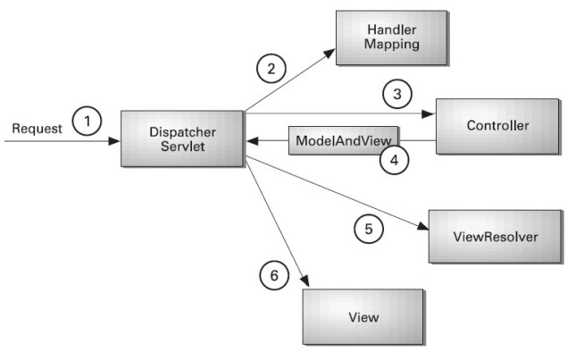

## 1 SpringMVC 第一天课堂笔记

学习过的 MVC 框架：Struts2

Spring MVC 就是类似于 Struts2 的 MVC 框架，属于 SpringFrameWork 的后续产品。

## 2 为什么学 Spring MVC?

### SpringMVC 与 Struts2 区别

|    对比项目    |                  SrpingMVC                   |                     Struts2                      |                             优势                             |
| :------------: | :------------------------------------------: | :----------------------------------------------: | :----------------------------------------------------------: |
|  国内市场情况  | 有大量用户，一般新项目启动都会选用 SpringMVC | 有部分老用户，老项目组，由于习惯了，一直在使用。 |         国内情况，SpringMVC 的使用率已经超过 Struts2         |
|    框架入口    |                 基于 Servlet                 |                   基于 filter                    |           本质上没太大优势之分，只是配置方式不一样           |
|  框架设计思想  | 控制器基于方法级别的拦截，处理器设计为单实例 |   控制器基于类级别的拦截， 处理器设计为多实例    | 由于设计本身原因，造成了 Struts2，通常来讲只能设计为多实例模式，相比于SpringMVC 设计为单实例模式，Struts2 会消耗更多的服务器内存。 |
|    参数传递    |             参数通过方法入参传递             |             参数通过类的成员变量传递             | Struts2 通过成员变量传递参数，导致了参数线程不安全，有可能引发并发的问题。 |
| 与 Spring 整合 | 与 Spring 同一家公司，可以与 Spring 无缝整合 |                    需要整合包                    |              SpringMVC 可以更轻松与 Spring 整合              |

## 3 SpringMVC 入门

### 3.1 开发环境

| JDK           | JDK 1.8              |
| ------------- | -------------------- |
| IntelliJ IDEA | IntelliJ IDEA        |
| Tomcat        | apache-tomcat-9.0.10 |
| Spring        | 4.3.18               |

### 3.2 开发步骤

#### 3.2.1 创建 Dynamic Web 项目

课堂上起的项目名字：01-springmvc

#### 3.2.2 导入 Springmvc 的 jar 包

```powershell
.
├── index.jsp
├── jsp
│   ├── hello.jsp
│   ├── itemEdit.jsp
│   └── itemList.jsp
├── lib
│   ├── commons-logging-1.1.1.jar
│   ├── jstl-1.2.jar
│   ├── spring-aop-4.2.4.RELEASE.jar
│   ├── spring-beans-4.2.4.RELEASE.jar
│   ├── spring-context-4.2.4.RELEASE.jar
│   ├── spring-core-4.2.4.RELEASE.jar
│   ├── spring-expression-4.2.4.RELEASE.jar
│   ├── spring-web-4.2.4.RELEASE.jar
│   └── spring-webmvc-4.2.4.RELEASE.jar
└── web.xml

```

#### 3.2.3 编写 TestController 类

```java
@Controller
public class HelloControll {
    @RequestMapping("hello")
    public ModelAndView hello() {
        System.out.println("Hello, SpringMVC...");
        ModelAndView mav = new ModelAndView();
        //设置模型数据，用于传递到jsp
        mav.addObject("msg", "Hello, SpringMVC!");
        //设置视图名字，用于响应用户
        mav.setViewName("WEB-INF/jsp/hello.jsp");

        return mav;
    }
}
```
#### 3.2.4 创建 `hello.jsp` 页面

#### 3.2.5 创建与配置 springmvc.xml 核心配置文件

```xml
<?xml version="1.0" encoding="UTF-8"?>
<beans xmlns="http://www.springframework.org/schema/beans"
       xmlns:xsi="http://www.w3.org/2001/XMLSchema-instance"
       xmlns:context="http://www.springframework.org/schema/context"
       xmlns:mvc="http://www.springframework.org/schema/mvc"
       xsi:schemaLocation="http://www.springframework.org/schema/beans http://www.springframework.org/schema/beans/spring-beans-4.0.xsd
        http://www.springframework.org/schema/mvc http://www.springframework.org/schema/mvc/spring-mvc-4.0.xsd
        http://www.springframework.org/schema/context http://www.springframework.org/schema/context/spring-context-4.0.xsd">

    <!-- 配置controller扫描包 -->
    <context:component-scan base-package="com.lightwing.springmvc.controller"/>

    <!-- 配置处理器映射器 -->
    <!-- <bean class="org.springframework.web.servlet.mvc.method.annotation.RequestMappingHandlerMapping"/> -->
    <!-- 配置处理器适配器-->
    <!-- <bean class="org.springframework.web.servlet.mvc.method.annotation.RequestMappingHandlerAdapter"/> -->

    <!-- 配置注解驱动，相当于同时使用最新处理器映射跟处理器适配器,对json数据响应提供支持 -->
    <mvc:annotation-driven/>

    <!-- 配置视图解析器 -->
    <bean class="org.springframework.web.servlet.view.InternalResourceViewResolver">
        <property name="prefix" value="/WEB-INF/jsp/"/>
        <property name="suffix" value=".jsp"/>
    </bean>
</beans>
```

#### 3.2.6 在 web.xml 中配置前端控制器

```xml
<?xml version="1.0" encoding="UTF-8"?>
<web-app xmlns:xsi="http://www.w3.org/2001/XMLSchema-instance"
         xmlns="http://java.sun.com/xml/ns/javaee"
         xsi:schemaLocation="http://java.sun.com/xml/ns/javaee http://java.sun.com/xml/ns/javaee/web-app_2_5.xsd"
         id="WebApp_ID" version="2.5">
    <display-name>01-springmvc</display-name>
    <welcome-file-list>
        <welcome-file>index.html</welcome-file>
        <welcome-file>index.htm</welcome-file>
        <welcome-file>index.jsp</welcome-file>
        <welcome-file>default.html</welcome-file>
        <welcome-file>default.htm</welcome-file>
        <welcome-file>default.jsp</welcome-file>
    </welcome-file-list>

    <!--核心控制器的配置  -->
    <servlet>
        <servlet-name>springmvc</servlet-name>
        <servlet-class>org.springframework.web.servlet.DispatcherServlet</servlet-class>

        <!-- 加载 SpringMVC 核心配置文件 -->
        <init-param>
            <param-name>contextConfigLocation</param-name>
            <param-value>classpath:springmvc.xml</param-value>
        </init-param>
    </servlet>

    <servlet-mapping>
        <servlet-name>springmvc</servlet-name>
        <url-pattern>*.action</url-pattern>
    </servlet-mapping>
</web-app>
```

#### 3.2.7 启动项目通过浏览器测试

### 3.3 小结 SpringMVC 代码执行流程



## 4 完成商品列表加载

复制第一个项目01-springmvc，粘贴在本项目目录下改名:02-springmvc，删掉web.xml核心控制器的配置，重新配置一次（多练习一次）。

### 4.1 复制 itemList.jsp 到新工程中

目录：\01课前资料\案例\jsp

### 4.2 创建 `Item` 的 `pojo`

```java
public class Item {
    private int id;
    private String name;
    private double price;
    private Date createtime;
    private String detail;

    public Item() {
        super();
    }

    public Item(int id, String name, double price, Date createtime, String detail) {
        super();
        this.id = id;
        this.name = name;
        this.price = price;
        this.createtime = createtime;
        this.detail = detail;
    }
    // ...
}
```

### 4.3 编写 ItemController

```java
@Controller
public class ItemController {
    @RequestMapping("itemList")
    public ModelAndView itemList() {
        ModelAndView mav = new ModelAndView();

        // 模拟查询商品列表
        List<Item> list = Arrays.asList(
                new Item(84833, "Cheese - Mozzarella, Buffalo", 9366.16, new Date(), "eespinazo0@mashable.com"),
                new Item(77848, "Scotch - Queen Anne", 7268.77, new Date(), "droseveare1@reddit.com"),
                new Item(79733, "Lettuce - Romaine, Heart", 1577.04, new Date(), "vmartins2@abc" +
                        ".net.au"),
                new Item(59265, "Pastry - Apple Large", 5524.49, new Date(), "lbyard3@hp.com")
        );
        mav.addObject("itemList", list);
        mav.setViewName("itemList");

        return mav;
    }
}
```

### 4.4 启动项目通过浏览器测试

## 5 SpringMVC 架构

### 5.1 框架默认加载组件


#### 5.1.1 处理器映射器与处理器适配器

##### 5.1.1.1 处理器映射器

从 Spring3.1 版本开始，废除了 `DefaultAnnotationHandlerMapping` 的使用，推荐使用 `RequestMappingHandlerMapping` 完成注解式处理器映射。

```xml
<!-- 配置处理器映射器 -->
<bean class="org.springframework.web.servlet.mvc.method.annotation.RequestMappingHandlerMapping"/>
```

##### 5.1.1.2 处理器适配器

从 Spring3.1 版本开始，废除了 AnnotationMethodHandlerAdapter 的使用，推荐使用RequestMappingHandlerAdapter完成注解式处理器适配。

```xml
<!-- 处理器适配器 -->
	<bean class="org.springframework.web.servlet.mvc.method.annotation.RequestMappingHandlerAdapter" />
```

##### 5.1.1.3 小结

映射器与适配器必需配套使用，如果映射器使用了推荐的RequestMappingHandlerMapping，适配器也必需使用推荐的RequestMappingHandlerAdapter。

##### 5.1.1.4 注解驱动

```xml
<!-- 注解驱动配置，代替映射器与适配器的单独配置，同时支持json响应(推荐使用) -->
	<mvc:annotation-driven />
```

#### 5.1.2 视图解析器

```xml
<!-- 配置视图解析器 -->
	<bean class="org.springframework.web.servlet.view.InternalResourceViewResolver">
		<!-- 配置视图响应的前缀 -->
		<property name="prefix" value="/WEB-INF/jsp/" />
		<!-- 配置视图响应的后缀 -->
		<property name="suffix" value=".jsp" />
	</bean>
```

### 5.2 总结 SpringMVC 架构


## 6 SpringMVC 与 MyBatis 整合

创建Web新工程：03-springmvc-mybatis

1. 参考思路与我提供的代码工程，自己动手搭建新工程。
2. 整合功能主要是把商品列表加载，从数据库中查出。
3. Dao 开发可以用 Mybatis 逆向工程。

### 6.1 思路

#### 1 Dao 层：

1. SqlMapConfig.xml，空文件即可。需要文件头。
2. applicationContext-dao.xml。

a. 数据库连接池
b. SqlSessionFactory 对象，需要 Spring 和 MyBatis 整合包下的。
c. 配置 mapper 文件扫描器。

#### 2 Service 层：

1. applicationContext-service.xml 包扫描器，扫描 @service 注解的类。
2. applicationContext-trans.xml 配置事务。

#### 3 Controller 层：

`Springmvc.xml`

1. 包扫描器，扫描 @Controller 注解的类。
2. 配置注解驱动。
3. 视图解析器

#### 4 Web.xml

1. 配置 Spring 容量监听器
2. 配置前端控制器

### 7 参数绑定

### 7.1 默认支持的参数类型

基于完成需求：点击修改商品时，打开商品编辑页面，展示商品信息

```java
@RequestMapping("itemEdit")
public ModelAndView itemEdit(HttpServletRequest request, HttpServletResponse response, HttpSession session) {
    ModelAndView mav = new ModelAndView();
    //request获取参数
    String id = request.getParameter("id");
    System.out.println("id为：" + id);
    //其它对象输出
    System.out.println("response对象:" + response);
    System.out.println("session对象:" + session);
    //查询商品信息
    Item item = itemServices.getItemById(new Integer(id));
    //设置商品数据返回页面
    mav.addObject("item", item);
    //设置视图名称
    mav.setViewName("itemEdit");
    return mav;
}
```

### 7.2 绑定简单参数		

```java
@RequestMapping("itemEdit")
public ModelAndView itemEdit(@RequestParam(value = "id", required = true, defaultValue = "1")Integer ids) {
    ModelAndView mav = new ModelAndView();
    //查询商品信息
    Item item = itemServices.getItemById(ids);
    //设置商品数据返回页面
    mav.addObject("item", item);
    //设置视图名称
    mav.setViewName("itemEdit");
    return mav;
}
```

### 7.3 Model/ModelMap

```java
@RequestMapping("itemEdit")
public String itemEdit(@RequestParam("id")Integer ids, Model m, ModelMap model) {
    //查询商品信息
    Item item = itemServices.getItemById(ids);
    //通过Model把商品数据返回页面
    model.addAttribute("item", item);
    //返回String视图名字
    return "itemEdit";
}
```

### 7.4 绑定 pojo 对象

要点：表单提交的 name 属性必需与 pojo 的属性名称一致。

```java
@RequestMapping("updateItem")
public String updateItem(Item item, Model model) {
    //更新商品
    itemServices.update(item);
    //返回商品模型
    model.addAttribute("item", item);
    //返回担任提示
    model.addAttribute("msg", "修改商品成功");
    //返回修改商品页面
    return "itemEdit";
}
```

### 7.5 绑定包装的 pojo

要点：通过点(.)传递属性。

#### 7.5.1 pojo:

#### 7.5.2 controller 代码：

```java
@RequestMapping("queryItem")
public String queryItem(QueryVo vo) {
    //打印传入参数
    System.out.println(vo);
    //返回视图
    return "itemList";
}
```

#### 7.5.3 jsp 修改：

```jsp

```


## 1 Spring MVC 第二天课堂笔记

## 2 高级参数绑定

### 2.1 数组类型的参数绑定

基于批量删除商品操作完成参数传递。

#### 1. JSP 修改

```jsp
<%@ page contentType="text/html; charset=UTF-8"
         pageEncoding="UTF-8" %>
<%@ taglib uri="http://java.sun.com/jsp/jstl/core" prefix="c" %>
<%@ taglib uri="http://java.sun.com/jsp/jstl/fmt" prefix="fmt" %>
<!DOCTYPE html PUBLIC "-//W3C//DTD HTML 4.01 Transitional//EN" "http://www.w3.org/TR/html4/loose.dtd">
<html>
<head>
    <meta http-equiv="Content-Type" content="text/html; charset=UTF-8">
    <title>查询商品列表</title>
</head>
<body>
${ msg }
<form action="${ pageContext.request.contextPath }/queryItem.action" method="post">
    查询条件：
    <table width="100%" border=1>
        <tr>
            <td>商品名称:
                <label>
                    <input type="text" name="item.name">
                </label>
            </td>
            <td>商品价格:
                <label>
                    <input type="text" name="item.price">
                </label>
            </td>
        </tr>
        <tr>
            <td>
                <input type="submit" value="查询"/>
            </td>
        </tr>
    </table>
    商品列表：
    <table width="100%" border=1>
        <tr>
            <td>选择</td>
            <td>商品名称</td>
            <td>商品价格</td>
            <td>生产日期</td>
            <td>商品描述</td>
            <td>操作</td>
        </tr>
        <c:forEach items="${itemList }" var="item" varStatus="status">
            <tr>
                <td>
                    <label>
                        <input type="checkbox" name="ids" value="${item.id}">
                    </label>
                </td>
                <td>
                    <input type="hidden" name="items[${ status.index }].id" value="${item.id}">
                    <label>
                        <input type="text" name="items[${ status.index }].name"
                               value="${item.name }">
                    </label>
                </td>
                <td>
                    <label>
                        <input type="text" name="items[${ status.index }].price"
                               value="${item.price }">
                    </label>
                </td>
                <td>
                    <label>
                        <input type="text" name="items[${ status.index }].createtime"
                               value='<fmt:formatDate value="${ item.createtime }" 
                               pattern="yyyy-MM-dd HH:mm:ss"/>'>
                    </label>
                </td>
                <td>
                    <label>
                        <input type="text" name="items[${ status.index }].detail"
                               value="${ item.detail }">
                    </label>
                </td>
                <td>
                    <a href="${ pageContext.request.contextPath }/itemEdit.action?id=${ item.id }">
                        修改</a>
                </td>
            </tr>
        </c:forEach>
    </table>
</form>
</body>
</html>
```

#### 2. 控制器修改

```java
@RequestMapping("queryItem")
public String queryItem(QueryVo vo, Integer[] ids) {
    System.out.println(vo);
    
    // 输出传入的数组
    if (ids != null && ids.length > 0) {
        for (Integer id : ids)
            System.out.println("传入的商品列表分别为：" + id);
    }
    
    return "itemList";
}
```

### 2.2 List 类型的绑定

基于批量修改商品操作完成参数传递。

#### 1. JSP 修改

```java

```

#### 2. 控制器修改

```java

```

#### 3. POJO 修改

```java

```

## 3 `@RequestMapping` 注解的使用

### 3.1 路径映射可以是数组

```java

```

### 3.2 `@RequestMapping` 可以加在类头部，用于目录分级管理

```java

```

### 3.3 限定请求方法

```java

```

## 4 `Controller` 方法返回值

### 4.1 返回 ModelAndView

参考第一天内容。

### 4.2 返回void

#### 4.2.1 `request`

```java

```

##### 新建 msg.jsp

```jsp

```

#### 4.2.2 `response`

```java

```

### 4.3 返回 String

#### 4.3.1 返回视图名字，参考第一天内容

#### 4.3.2 `redirect` 与 `forward`

```java

```

## 5 Spring MVC 中异常处理

思想：做一个全局异常处理器，处理所有没有处理过的运行时异常用于更友好地提示用户。

### 5.1 步骤

#### 5.1.1 创建全局异常处理器

```java
/**
 * 全局异常处理器
 *
 * @author Lightwing Ng
 */
public class CustomerExceptionResolver implements HandlerExceptionResolver {
    @Override
    public ModelAndView resolveException(
            HttpServletRequest request,
            HttpServletResponse response,
            Object handler,
            Exception ex) {
        String result = "The System is failed, please contact<br>administrator: lightwing" +
                ".ng@gmail.com";
        // 自定义异常处理
        if (ex instanceof MyException)
            result = ((MyException) ex).getMsg();
        ModelAndView mav = new ModelAndView();
        mav.addObject("msg", result);
        mav.setViewName("msg");

        return mav;
    }
}
```

#### 5.1.2 配置异常处理器

#### 5.1.3 测试访问 `queryVoid.action`

#### 5.1.4 更智能、更友好的提示，解决方案

##### 5.1.4.1 新建自定义异常类

```java
/**
 * 自定异常
 *
 * @author Lightwing Ng
 */
public class MyException extends Exception {
    private String msg;

    public MyException() {
        super();
    }

    public MyException(String msg) {
        super();
        this.msg = msg;
    }

    public String getMsg() {
        return msg;
    }

    public void setMsg(String msg) {
        this.msg = msg;
    }
}
```

##### 5.1.4.2 修改异常处理器，加上异常判断

##### 5.1.4.3 测试访问 queryVoid.action

## 6 图片上传处理

### 6.1 配置虚拟目录


### 6.2 加入上传功能需要的jar包


### 6.3 配置多媒体解析器

```xml
<!-- 配置多媒体处理器 -->
<!-- 注意：这里id必须填写：multipartResolver -->
<bean id="multipartResolver" class="org.springframework.web.multipart.commons.CommonsMultipartResolver"> 
  	<!-- 最大上传文件大小 -->  
  	<property name="maxUploadSize" value="8388608"/> 
</bean>
```

### 6.4 JSP 修改

1

```jsp

```

2

```jsp

```

### 6.5 编写图片上传处理代码

```java
@RequestMapping(value = "updateItem", method = {RequestMethod.POST, RequestMethod.GET})
public String updateItem(Item item, MultipartFile pictureFile, Model model) throws Exception {
    // 图片新名字
    String newName = UUID.randomUUID().toString();
    // 图片原来的名字
    String oldName = pictureFile.getOriginalFilename();
    // 后缀
    String sux = oldName.substring(oldName.lastIndexOf("."));
    // 新建本地文件流
    File file = new File("build/" + newName + sux);
    // 写入本地磁盘
    pictureFile.transferTo(file);
    // 保存图片到数据库
    item.setPic(newName + sux);
    itemService.updateItem(item);
    model.addAttribute("item", item);
    model.addAttribute("msg", "修改商品信息成功");
    return "itemEdit";
    // return "forward:itemList.action";
    // return "redirect:itemList.action";
}
```

## 7 JSON 数据交互

### 7.1 加入 jar 包

```

```

### 7.2 编码

```java
@RequestMapping("getItem")
@ResponseBody
//@RequestBody用于接收用户传入json串转成pojo
public Item getItem(@RequestBody Item item2) {
    System.out.println("接收到的json商品数据为：" + item2);
    Item item = itemServices.getItemById(3);
    return item;
}
```

### 7.3 测试，安装 Chrome 浏览器测试工具

详情可查看教案上的安装谷歌浏览器工具节点

## 8 Spring MVC 实现 RESTful

### 8.1 编码

```java
@RequestMapping("item/{id}")
public String itemQuery(@PathVariable("id") Integer ids, Model model) {
    // 查询商品信息
    Item item = itemService.getItemById(ids);
    // model返回数据模型
    model.addAttribute("item", item);
    // mav.addObject("item", item);
    return "itemEdit";
}
```

### 8.2 测试

测试直接访问`url{http://localhost:8080/项目名/item/1.action}`即可。

## 9 拦截器

### 9.1 拦截器开发流程

#### 9.1.1 创建拦截器

##### 9.1.1.1 一号拦截器

```java
/**
 * 自定义拦截器
 *
 * @author Lightwing Ng
 */
public class MyInterceptor implements HandlerInterceptor {
    // 方法执行后被执行
    // 处理异常，清资源，记录日志等等
    @Override
    public void afterCompletion(HttpServletRequest arg0, HttpServletResponse arg1, Object arg2, Exception arg3) {
        System.out.println("MyInterceptor.afterCompletion.......");
    }

    // 方法执行之后，返回ModelAndView之前被执行
    // 设置页面的共用参数等等
    @Override
    public void postHandle(HttpServletRequest arg0, HttpServletResponse arg1, Object arg2, ModelAndView arg3) {
        System.out.println("MyInterceptor.postHandle.......");
    }

    // 进入方法前被执行
    // 登录拦截，权限验证等等
    @Override
    public boolean preHandle(HttpServletRequest arg0, HttpServletResponse arg1, Object arg2) {
        System.out.println("MyInterceptor.preHandle.......");
        // true放行,false拦截
        return true;
    }
}
```

##### 9.1.1.2 二号拦截器，复制一号，修改一下系统输出消息

```java
/**
 * 自定义拦截器
 *
 * @author Lightwing Ng
 */
public class MyInterceptor2 implements HandlerInterceptor {
    // 方法执行后被执行
    // 处理异常，清资源，记录日志等等
    @Override
    public void afterCompletion(HttpServletRequest arg0, HttpServletResponse arg1, Object arg2, Exception arg3) {
        System.out.println("MyInterceptor2.afterCompletion.......");
    }

    // 方法执行之后，返回ModelAndView之前被执行
    // 设置页面的共用参数等等
    @Override
    public void postHandle(HttpServletRequest arg0, HttpServletResponse arg1, Object arg2, ModelAndView arg3) {
        System.out.println("MyInterceptor2.postHandle.......");
    }

    // 进入方法前被执行
    // 登录拦截，权限验证等等
    @Override
    public boolean preHandle(HttpServletRequest arg0, HttpServletResponse arg1, Object arg2) {
        System.out.println("MyInterceptor2.preHandle.......");
        // true放行,false拦截
        return true;
    }
}
```

#### 9.1.2 配置拦截器

```xml
<!-- 拦截器定义 -->
	<mvc:interceptors>
		<!-- 定义一个拦截器 -->
		<mvc:interceptor>
			<!-- path配置</**>拦截所有请求，包括二级以上目录，</*>拦截所有请求，不包括二级以上目录 -->
			<mvc:mapping path="/**"/>
			<bean class="com.itheima.springmvc.interceptor.MyInterceptor1" />
		</mvc:interceptor>
			<!-- 定义一个拦截器 -->
	<mvc:interceptor>
		<!-- path配置</**>拦截所有请求，包括二级以上目录，</*>拦截所有请求，不包括二级以上目录 -->
		<mvc:mapping path="/**"/>
		<bean class="com.itheima.springmvc.interceptor.MyInterceptor2" />
	</mvc:interceptor>
</mvc:interceptors>
```

#### 9.1.3 测试流程，可参考教案

0

### 9.2 拦截器案例应用，登录拦截器

#### 9.2.1 思路

1. 有一个登录页面，需要写一个 controller 访问页面
2. 登录页面有一提交表单的动作。需要在 controller 中处理。

- 判断用户名密码是否正确
- 如果正确 想 session 中写入用户信息
- 返回登录成功，或者跳转到商品列表

3. 拦截器。

- 拦截用户请求，判断用户是否登录
- 如果用户已经登录。放行
- 如果用户未登录，跳转到登录页面。

#### 9.2.2 `login.jsp`

```jsp
<%@ page contentType="text/html; charset=UTF-8" pageEncoding="UTF-8" %>
<!DOCTYPE html PUBLIC "-//W3C//DTD HTML 4.01 Transitional//EN" "http://www.w3.org/TR/html4/loose.dtd">
<html>
<head>
    <meta http-equiv="Content-Type" content="text/html; charset=UTF-8">
    <title>用户登录</title>
</head>
<body>
<form action="${pageContext.request.contextPath }/user/login.action">
    用户名：
    <label>
        <input type="text" name="username"/>
    </label><br>
    密码：
    <label>
        <input type="password" name="password"/>
    </label><br>
    <input type="submit">
</form>
</body>
</html>
```

#### 9.2.3 `UserController`

```java
@Controller
@RequestMapping("user")
public class UserController {
    @RequestMapping("toLogin")
    public String toLogin() {
        return "login";
    }
    
    @RequestMapping("login")
    public String login(String username, String password, HttpSession session) {
        String result = "login";
        
        // 断定用户是否允许登录
        if (username != null) {
            session.setAttribute("username", username);
            // 登录成功，跳转商品列表
            result = "redirect:/itemList.action";
        }
        return result;
    }
}
```

#### 9.2.4 `LoginInterceptor` 拦截器编码

这里省略类声名和其它两个方法。

```java
// 处理执行前被执行
// 登录拦截、权限验证
@Override
public boolean preHandle(HttpServletRequest request, HttpServletResponse response, Object arg2) throws Exception {
    Object attribute = request.getSession().getAttribute("username");
    
    if (attribute != null) {
        //放行，执行处理器
        return true;
    } else {
        response.sendRedirect(request.getContextPath() + "/user/tologin.action");
        //放行，执行处理器
        return false;
    }
}
```
#### 9.2.5 拦截器配置

```xml
<!-- 登录拦截器 -->
<mvc:interceptor>
		<!-- path配置</**>拦截所有请求，包括二级以上目录，</*>拦截所有请求，不包括二级以上目录 -->
		<mvc:mapping path="/**"/>
	<!-- 配置不拦截请求的地址 -->
		<!-- <mvc:exclude-mapping path="/user/toLogin.action"/>
		<mvc:exclude-mapping path="/user/login.action"/> -->
		<mvc:exclude-mapping path="/user/*"/>
	<bean class="com.itheima.springmvc.interceptor.LoginInterceptor" />
</mvc:interceptor>
```


